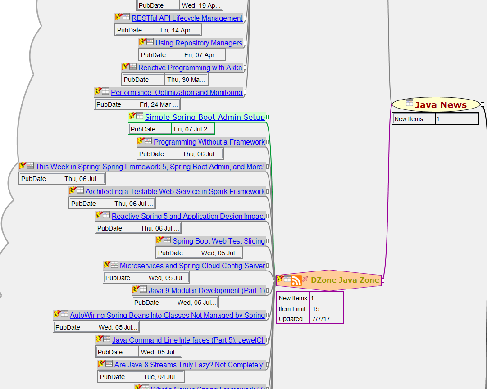

# Freeplane addon: WetHat NewsReader

This addon for the open source mind mapping and knowledge management tool [Freeplane](https://www.freeplane.org/wiki/index.php/Main_Page)
manages RSS news channels and news item as nodes in a mind map:

The addon provides basic new reading and management functionality such as:

* Subscribing to a news channels
* Updating news channels
* Structural organization of news channels
* Marking news items as read / unread
* Metadata to support custom conditional styles

