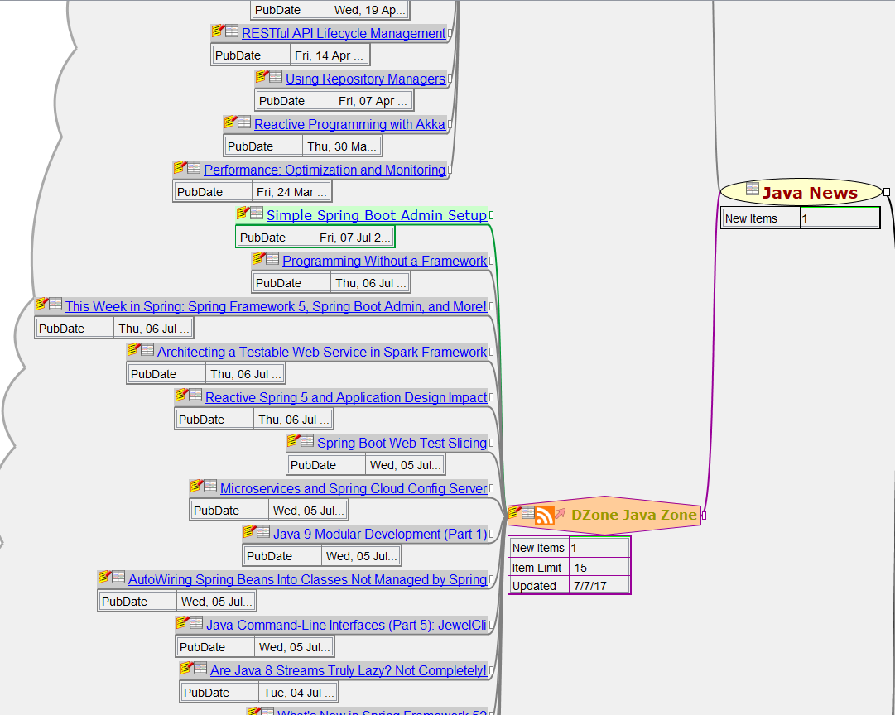

# Freeplane addon: WetHat NewsReader

This addon for the open source mind mapping and knowledge management tool [Freeplane](https://www.freeplane.org/wiki/index.php/Main_Page)
manages RSS news channels and news items as nodes in a mind map.

**Download latest release**: [WetHatNewsreader-0.2.0.addon.mm](https://github.com/WetHat/freeplane-addon-newsreader/releases/download/v0.2.0/WetHatNewsreader-0.2.0.addon.mm)

See [Release History](https://github.com/WetHat/freeplane-addon-newsreader/releases) for older releases.

The addon provides basic news reading and management functionality such as:

* Subscribing to news channels
* Updating news channels
* Structural organization of news channels (as mind map nodes)
* Marking news items as read / unread
* Rollup calculation of the number of new (unread) items below a branch in the channel structure
* Metadata to support custom conditional styles
* Currently supported formats: RSS, ATOM

